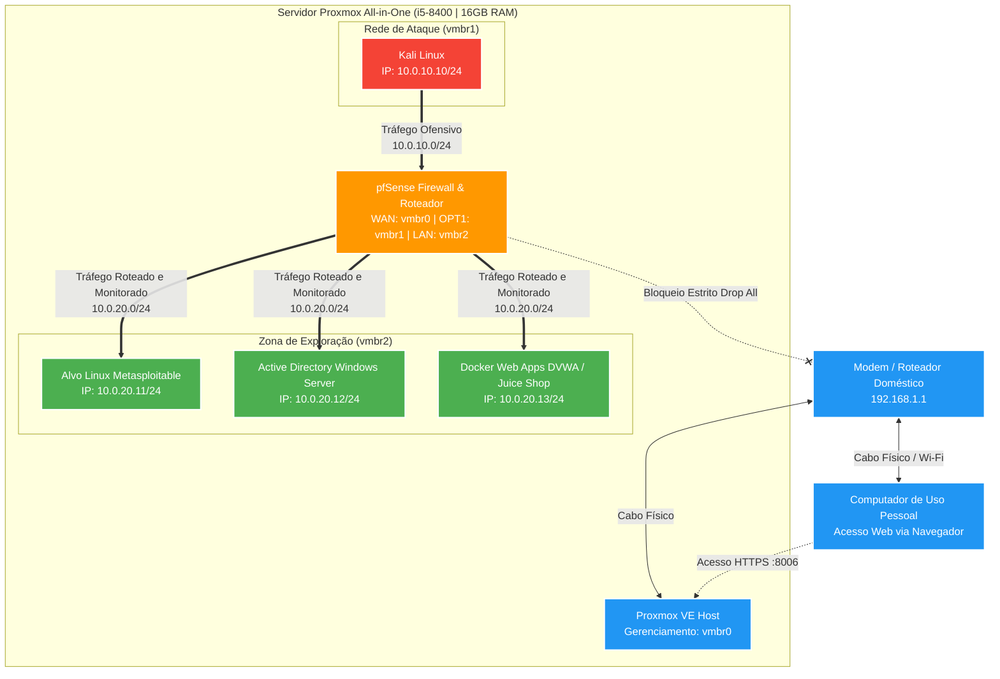

# 🧪 Homelab Exploration Zone

Laboratório de cibersegurança e pesquisa de vulnerabilidades implementado inteiramente sobre o hipervisor Proxmox VE. 

O ambiente centraliza o host de ataque (Kali Linux), a camada de controle/roteamento (pfSense) e os alvos vulneráveis em um único servidor físico dedicado. O tráfego ofensivo permanece 100% confinado na memória e nas bridges virtuais do hipervisor, garantindo que a rede doméstica e o computador pessoal atuem estritamente como clientes de gerenciamento web (GUI), sem exposição ou risco de vazamento de pacotes maliciosos.

> ⚠️ **Este laboratório é destinado exclusivamente a ambientes próprios ou explicitamente autorizados.**

---

## 🖥️ Especificações do Hardware

* **Processador:** Intel Core i5-8400 (6 núcleos / 6 threads, 2.80 GHz base até 4.00 GHz turbo)
* **Memória RAM:** 16 GB DDR4
* **Armazenamento Principal (SSD 230 GB):** Sistema operacional (Proxmox VE), swap e discos virtuais prioritários de alta I/O (pfSense, Kali Linux, Windows Server).
* **Armazenamento Secundário (HDD 500 GB):** Datastore dedicado a imagens ISO, templates, backups, snapshots e alvos Linux leves (Metasploitable, contêineres Docker).

---

## 🏗️ Arquitetura e Segmentação de Rede

O isolamento do laboratório é estruturado em três bridges Linux independentes dentro do Proxmox:

1. **`vmbr0` (Gerência & Acesso WAN):** Conectada à placa de rede física do servidor. Dá acesso à LAN doméstica para gerência do Proxmox (`https://IP:8006`) e fornece conexão de internet para a interface WAN do pfSense.
2. **`vmbr1` (Rede de Ataque - Não Atrelada a Portas Físicas):** Barramento virtual interno exclusivo para a máquina de ataque (Kali Linux) e a interface `OPT1` do pfSense.
3. **`vmbr2` (Zona de Exploração - Não Atrelada a Portas Físicas):** Barramento virtual isolado que abriga os alvos de exploração (Linux, Windows Active Directory, Docker) e a interface `LAN` do pfSense.



---

## 📁 Estrutura do Repositório

```
homelab-exploration-zone/
├── README.md               # Documentação principal e visão arquitetural
├── docs/                   # Diagramas, matriz de endereçamento IP e fluxos de tráfego
│   ├── topologia.md
│   └── plano-enderecamento.md
├── infraestrutura/
│   ├── proxmox/            # Configurações de rede (/etc/network/interfaces) e storages
│   └── firewall/           # Regras de tráfego, aliases e backups do pfSense
├── maquina-atacante/
│   └── kali/               # Scripts de pós-instalação e listas de ferramentas
└── alvos-exploracao/
    ├── active-directory/   # Procedimentos de deployment do AD e scripts BadBlood
    ├── linux/              # Notas de configuração de alvos Linux clássicos
    └── web-docker/         # Arquivos Docker Compose (DVWA, OWASP Juice Shop)
```

---

## 🚀 Roadmap de Implantação

- [ ] Fase 1: Preparação do Hipervisor Proxmox VE
    - Instalação limpa do Proxmox VE no SSD de 230 GB.
    - Particionamento e montagem do HDD de 500 GB como storage secundário (Directory ou LVM-Thin).
    - Atualização dos repositórios para a versão no-subscription.

- [ ] Fase 2: Infraestrutura de Rede Virtual

    - Criação da bridge interna vmbr1 (sem portas físicas associadas).
    - Criação da bridge interna vmbr2 (sem portas físicas associadas).
    - Validação da retenção do tráfego interno no switch virtual do kernel.

- [ ] Fase 3: Implantação do Firewall (pfSense)

    - Criação da VM do pfSense com 3 interfaces virtuais (vmbr0, vmbr1, vmbr2).
    - Configuração das faixas de IP: WAN via DHCP doméstico, OPT1 (10.0.10.1/24) e LAN (10.0.20.1/24).
    - Aplicação de regras de firewall: permissão de tráfego de OPT1 para LAN, e bloqueio explícito de qualquer comunicação originada na vmbr1/vmbr2 em direção à rede doméstica (192.168.1.0/24).

- [ ] Fase 4: Provisionamento da Estação de Ataque

    - Instalação do Kali Linux conectado à interface vmbr1 (armazenado no SSD).
    - Configuração do gateway apontando para a interface do pfSense.

- [ ] Fase 5: Provisionamento dos Alvos de Estudo

    - Instalação e deployment de alvos web em contêineres Docker via Alpine/Debian (vmbr2).
    - Implantação de laboratório Active Directory enxuto com Windows Server Evaluation e BadBlood (vmbr2).
    - Importação de máquinas legadas e desafios de exploração (Metasploitable, VulnHub).

## 📄 Licença e Aviso Legal
Distribuído sob a licença MIT. Consulte LICENSE para mais detalhes.

> ⚠️ Aviso Legal: Todo o tráfego gerado pelas ferramentas ofensivas deve ser mantido estritamente confinado aos barramentos virtuais isolados (vmbr1 e vmbr2). A realização de varreduras, ataques ou explorações sem consentimento prévio e formal contra alvos fora do ambiente virtualizado é estritamente ilegal.