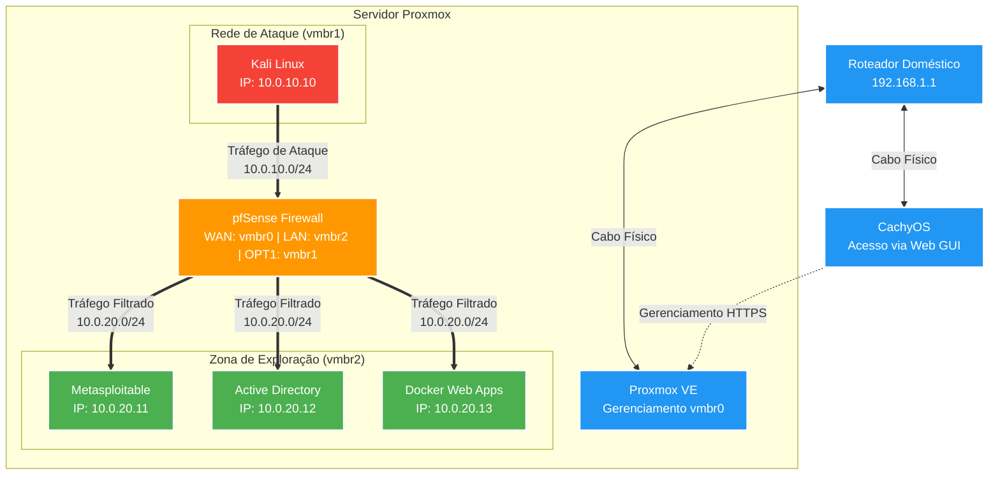

# Topologia da Zona de Exploração

O diagrama abaixo detalha a separação física e lógica entre a rede doméstica, a máquina atacante e o laboratório de alvos.

```mermaid
flowchart TD
    %% Infraestrutura Doméstica
    Router[Roteador Doméstico\n192.168.1.1]
    CachyOS[CachyOS\nAcesso via Web GUI]

    subgraph "Servidor Proxmox"
        Proxmox[Proxmox VE\nGerenciamento vmbr0]
        FW["pfSense Firewall\nWAN: vmbr0 | LAN: vmbr2 | OPT1: vmbr1"]
        
        subgraph "Rede de Ataque (vmbr1)"
            Kali[Kali Linux\nIP: 10.0.10.10]
        end

        subgraph "Zona de Exploração (vmbr2)"
            Vuln1[Metasploitable\nIP: 10.0.20.11]
            Vuln2[Active Directory\nIP: 10.0.20.12]
            Vuln3[Docker Web Apps\nIP: 10.0.20.13]
        end
    end

    %% Conexões
    Router <-->|Cabo Físico| Proxmox
    Router <-->|Cabo Físico| CachyOS
    CachyOS -.->|Gerenciamento HTTPS| Proxmox
    
    %% Roteamento Interno do Proxmox
    Kali == "Tráfego de Ataque\n10.0.10.0/24" ==> FW
    FW == "Tráfego Filtrado\n10.0.20.0/24" ==> Vuln1
    FW == "Tráfego Filtrado\n10.0.20.0/24" ==> Vuln2
    FW == "Tráfego Filtrado\n10.0.20.0/24" ==> Vuln3

    %% Estilização
    classDef redeSegura fill:#2196F3,color:#fff,stroke:#fff,stroke-width:2px;
    classDef redeAtaque fill:#f44336,color:#fff,stroke:#fff,stroke-width:2px;
    classDef redeAlvo fill:#4CAF50,color:#fff,stroke:#fff,stroke-width:2px;
    classDef fw fill:#FF9800,color:#fff,stroke:#fff,stroke-width:2px;

    class Router,CachyOS,Proxmox redeSegura;
    class Kali redeAtaque;
    class Vuln1,Vuln2,Vuln3 redeAlvo;
    class FW fw;
```